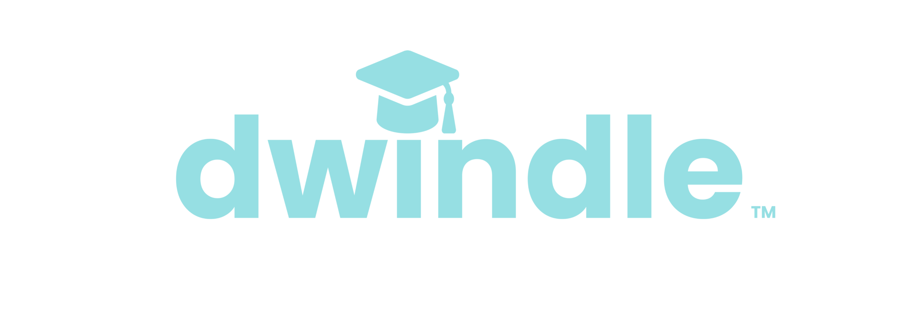

<div id="top"></div>


<!-- PROJECT LOGO -->
<br />
<div align="center">
  <a href="https://jobs.dwindlestudentdebt.com/">
    
  </a>

<h3 align="center">Dwindle</h3>

  <p align="center">
    A Job board that helps it's users dwindle down their student loan debt
    <br />
    <br />
    <br />
  </p>
</div>


<!-- TABLE OF CONTENTS -->
<details>
  <summary>Table of Contents</summary>
  <ol>
    <li>
      <a href="#about-the-project">About The Project</a>
      <ul>
        <li><a href="#built-with">Built With</a></li>
      </ul>
    </li>
    <li>
      <a href="#getting-started">Getting Started</a>
      <ul>
        <li><a href="#prerequisites">Prerequisites</a></li>
        <li><a href="#installation">Installation</a></li>
      </ul>
    </li>
    <li><a href="#license">License</a></li>
    <li><a href="#contact">Contact</a></li>
    
  </ol>
</details>


<!-- ABOUT THE PROJECT -->
## About The Project

[![Product Name Screen Shot][product-screenshot]](https://peppy-pika-fe5e5b.netlify.app/)

This project was created for one of our clients who is seeking to create a job board app that was catered to students who needed to pay down their school debt. The companies on our website offer unique benefits for students. On the companies page, you will notice four options: student loan repayment, 100% tuition coverage, tuition assistance, and tuition reimbursement. Once one of these options is clicked on it will take the user to a new page where it will list the companies with this type of benefit. 

● Backend Features : 
  - MailChimp Integration : provide the feature for email subscription and a weekly email template generation based on jobposting data
  - Postgres full text search 
  - Address standardization using a regular expression and Google Geocoding
  - Job hadnling queues using Bull and Redis
  - Logging/Database backup file upload using Google Cloud platform 
  - Custom REST APIs
  - Third-party Web Scraping API integration  


<p align="right">(<a href="#top">back to top</a>)</p>


### Built With


* [![React][React.js]][React-url]
* 
* 
* 
* 
* 
* 
* 
* 
* 
* 
* 
* 

<p align="right">(<a href="#top">back to top</a>)</p>


<!-- GETTING STARTED -->
## Getting Started
.

### Prerequisites

* npm
  ```sh
  npm install npm@latest -g
  ```

### Installation

1. Clone the repo
   ```sh
   git clone https://github.com/chingu-voyages/v39-geckos-team-05.git
   ```
2. Install NPM packages in client folder

    ```sh
    cd client
    ```
    then
    ```sh
    npm install
    ```
3. Install NPM packages in server folder

     ```sh
    cd server
    ```
    then
    ```sh
    npm install
    ```

<p align="right">(<a href="#top">back to top</a>)</p>


<!-- LICENSE -->
## License

Distributed under the MIT License. See `LICENSE.txt` for more information.

<p align="right">(<a href="#top">back to top</a>)</p>


<!-- CONTACT -->
## Contact

### Team
Bahareh - github: [https://github.com/onetoughcookie226](https://github.com/onetoughcookie226)

Wonjae - github: [https://github.com/lbfn83](https://github.com/lbfn83)

Mateo - github: [https://github.com/cruzma](https://github.com/cruzma)


Project Link: [https://github.com/chingu-voyages/v39-geckos-team-05](https://github.com/chingu-voyages/v39-geckos-team-05)

<p align="right">(<a href="#top">back to top</a>)</p>


<!-- MARKDOWN LINKS & IMAGES -->
<!-- https://www.markdownguide.org/basic-syntax/#reference-style-links -->
[contributors-shield]: https://img.shields.io/github/contributors/github_username/repo_name.svg?style=for-the-badge
[contributors-url]: https://github.com/github_username/repo_name/graphs/contributors
[forks-shield]: https://img.shields.io/github/forks/github_username/repo_name.svg?style=for-the-badge
[forks-url]: https://github.com/github_username/repo_name/network/members
[stars-shield]: https://img.shields.io/github/stars/github_username/repo_name.svg?style=for-the-badge
[stars-url]: https://github.com/github_username/repo_name/stargazers
[issues-shield]: https://img.shields.io/github/issues/github_username/repo_name.svg?style=for-the-badge
[issues-url]: https://github.com/github_username/repo_name/issues
[license-shield]: https://img.shields.io/github/license/github_username/repo_name.svg?style=for-the-badge
[license-url]: https://github.com/github_username/repo_name/blob/master/LICENSE.txt
[linkedin-shield]: https://img.shields.io/badge/-LinkedIn-black.svg?style=for-the-badge&logo=linkedin&colorB=555
[linkedin-url]: https://linkedin.com/in/linkedin_username
[product-screenshot]: client/src/images/dwindle.gif
[Next.js]: https://img.shields.io/badge/next.js-000000?style=for-the-badge&logo=nextdotjs&logoColor=white
[Next-url]: https://nextjs.org/
[React.js]: https://img.shields.io/badge/React-20232A?style=for-the-badge&logo=react&logoColor=61DAFB
[React-url]: https://reactjs.org/
[Vue.js]: https://img.shields.io/badge/Vue.js-35495E?style=for-the-badge&logo=vuedotjs&logoColor=4FC08D
[Vue-url]: https://vuejs.org/
[Angular.io]: https://img.shields.io/badge/Angular-DD0031?style=for-the-badge&logo=angular&logoColor=white
[Angular-url]: https://angular.io/
[Svelte.dev]: https://img.shields.io/badge/Svelte-4A4A55?style=for-the-badge&logo=svelte&logoColor=FF3E00
[Svelte-url]: https://svelte.dev/
[Laravel.com]: https://img.shields.io/badge/Laravel-FF2D20?style=for-the-badge&logo=laravel&logoColor=white
[Laravel-url]: https://laravel.com
[Bootstrap.com]: https://img.shields.io/badge/Bootstrap-563D7C?style=for-the-badge&logo=bootstrap&logoColor=white
[Bootstrap-url]: https://getbootstrap.com
[JQuery.com]: https://img.shields.io/badge/jQuery-0769AD?style=for-the-badge&logo=jquery&logoColor=white
[JQuery-url]: https://jquery.com 
